```mermaid
gantt
    title Learning Path Timeline
    dateFormat  X
    axisFormat %s
    
    section Cloud Fundamentals
    AWS Basics           :0, 2
    EC2 & Infrastructure :2, 4
    Security & Networking:4, 6
    
    section DevOps Mastery
    DevOps Culture       :6, 8
    CI/CD Automation     :8, 10
    Infrastructure as Code:10, 12
```

# ☁️ Cloud & DevOps Learning Path (Sandy)
## *Complete Professional Training Program for Modern IT Excellence*

<div align="center">


**🎯 Master Cloud Technologies & DevOps Practices | 🚀 Build Production-Ready Skills | 💼 Advance Your Career**

</div>

---

## 📋 Quick Navigation

<div align="center">

| [🎯 Overview](#-program-overview) | [🛤️ Learning Path](#️-learning-path) | [📚 Course Structure](#-course-structure) | [🚀 Getting Started](#-getting-started) |
|:---:|:---:|:---:|:---:|
| [🎓 Learning Outcomes](#-learning-outcomes) | [🛠️ Prerequisites](#️-prerequisites) | [💼 Career Impact](#-career-impact) | [👨‍💻 About Author](#-about-the-author) |

</div>

---

## 🎯 Program Overview

<div align="center">

### 🌟 **Welcome to the Future of IT Training**

> *Transform your career with hands-on cloud and DevOps expertise that industry leaders demand*

</div>

This comprehensive training program combines **cloud computing fundamentals** with **modern DevOps practices** to create a complete learning experience. You'll progress from basic cloud concepts to advanced automation techniques, building real-world projects that demonstrate your expertise.

### 🎪 **What Makes This Program Special**

<table>
<tr>
<td width="25%" align="center">

### 🔥 **Hands-On First**
Real projects, not just theory
- Live AWS deployments
- Production-ready code
- Industry scenarios

</td>
<td width="25%" align="center">

### 📊 **Industry Aligned**
Current market demands
- 2025 technology stack
- Enterprise practices
- Career-focused skills

</td>
<td width="25%" align="center">

### 🛠️ **Progressive Learning**
Build skills systematically
- Foundation to advanced
- Practical applications
- Portfolio development

</td>
<td width="25%" align="center">

### 🎯 **Career Ready**
Job market preparation
- Interview preparation
- Certification guidance
- Professional networking

</td>
</tr>
</table>

### 📈 **Program Statistics**
```
🎓 2 Major Sections | 🕐 12 Weeks Duration | 💻 10+ Hands-on Projects | 🏆 Industry Certifications
```

---

## 🛤️ Learning Path

<div align="center">

### 📅 **12-Week Professional Development Journey**

</div>

<table>
<tr>
<th width="50%" align="center">🌥️ Section 1: Cloud Fundamentals</th>
<th width="50%" align="center">🚀 Section 2: DevOps & Infrastructure as Code</th>
</tr>
<tr>
<td>

### **Weeks 1-6: Cloud Mastery**
- ☁️ **AWS Cloud Fundamentals**
- 🖥️ **EC2 & Infrastructure Management**
- 🔒 **Security & IAM Best Practices**
- 🌐 **Networking & VPC Configuration**
- 💰 **Cost Optimization Strategies**
- 📊 **Monitoring & CloudWatch**

**🎯 Outcome:** Deploy production websites on AWS

</td>
<td>

### **Weeks 7-12: DevOps Excellence**
- 🔄 **DevOps Culture & Principles**
- 🐧 **Linux & Command Line Mastery**
- 🔀 **Git & Version Control**
- ⚙️ **Jenkins CI/CD Automation**
- 🏗️ **Terraform Infrastructure as Code**
- 📈 **Monitoring & Observability**

**🎯 Outcome:** Automate infrastructure with code

</td>
</tr>
</table>

### 🎯 **Skill Progression Timeline**



---

## 📚 Course Structure

<details>
<summary><strong>🌥️ Section 1: Cloud Computing Fundamentals</strong></summary>

### **Duration:** 6 Weeks | **Focus:** AWS Cloud Mastery

#### 📖 **Session 1: Introduction to Cloud & AWS Infrastructure**
**What You'll Learn:**
- Cloud computing concepts and service models
- AWS global infrastructure and core services
- EC2 instance management and configuration
- Security Groups and network access control
- User Data automation for instance setup

**🛠️ Hands-On Project:**
- Deploy a professional website on AWS EC2
- Configure security and networking
- Implement automated server setup
- Monitor performance and costs

**📁 Resources:**
- [Session Materials](./Section-1-Cloud/Session-1_Introduction-to-Cloud-AWS-Infra/)
- Interactive labs and exercises
- Quick reference guides
- Assessment quizzes

#### 🎯 **Learning Outcomes:**
- ✅ Navigate AWS Console with confidence
- ✅ Deploy and manage EC2 instances
- ✅ Configure security and networking
- ✅ Implement cost optimization strategies
- ✅ Apply cloud best practices

</details>

<details>
<summary><strong>🚀 Section 2: DevOps & Infrastructure as Code</strong></summary>

### **Duration:** 6 Weeks | **Focus:** DevOps Automation Mastery

#### 📖 **Session 1: Introduction to DevOps**
- DevOps culture, principles, and transformation
- Breaking down Dev vs Ops stereotypes
- DevOps roles and career opportunities
- Legacy system challenges and solutions
- DevOps frameworks and patterns

#### 📖 **Session 2: Linux Fundamentals**
- Command line proficiency and shell scripting
- System administration and security
- Process management and monitoring
- Network configuration and troubleshooting

#### 📖 **Session 3: Mastering Git**
- Version control and collaborative development
- Branching strategies and workflows
- Git hooks and automation integration
- Best practices for code versioning

#### 📖 **Session 4: Jenkins CI/CD**
- Continuous Integration and Deployment
- Pipeline creation and management
- Automated testing and deployment
- Multi-environment strategies

#### 📖 **Terraform Module: Infrastructure as Code**
- Infrastructure automation and management
- Multi-cloud resource provisioning
- State management and collaboration
- Reusable modules and best practices

**📁 Resources:**
- [DevOps Section Materials](./Section-2-DevOps/)
- Professional presentation-style content
- Interactive labs and projects
- Career guidance and certification prep

#### 🎯 **Learning Outcomes:**
- ✅ Implement end-to-end CI/CD pipelines
- ✅ Automate infrastructure with Terraform
- ✅ Master Linux and Git workflows
- ✅ Apply DevOps culture and practices
- ✅ Build production-ready automation

</details>

---

## 🚀 Getting Started

<div align="center">

### 🔧 **Quick Setup Guide**

</div>

### **Step 1: Repository Setup**
```bash
# Clone the repository
git clone https://github.com/manikcloud/cloud-devops-learning-path.git

# Navigate to the project directory
cd cloud-devops-learning-path

# Explore the structure
ls -la
```

### **Step 2: Prerequisites Check**
<table>
<tr>
<td width="50%">

#### 💻 **System Requirements**
- **OS:** Linux, macOS, or Windows with WSL2
- **RAM:** Minimum 8GB (16GB recommended)
- **Storage:** 50GB free space
- **Internet:** Stable broadband connection

</td>
<td width="50%">

#### 🔧 **Required Accounts**
- **AWS Account:** Free tier eligible
- **GitHub Account:** For version control
- **Text Editor:** VS Code recommended
- **Terminal:** Command line access

</td>
</tr>
</table>

### **Step 3: Environment Setup**
```bash
# Install essential tools
# Git (if not already installed)
sudo apt-get install git -y

# AWS CLI
curl "https://awscli.amazonaws.com/awscli-exe-linux-x86_64.zip" -o "awscliv2.zip"
unzip awscliv2.zip && sudo ./aws/install

# Configure AWS credentials
aws configure

# Verify setup
aws --version && git --version
```

### **Step 4: Begin Learning**
1. **Start with Section 1:** [Cloud Fundamentals](./Section-1-Cloud/)
2. **Progress to Section 2:** [DevOps & IaC](./Section-2-DevOps/)
3. **Follow the structured path:** Complete each session in order
4. **Build your portfolio:** Document your projects and achievements

---

## 🎓 Learning Outcomes

<div align="center">

### 🏆 **What You'll Achieve**

</div>

<table>
<tr>
<td width="50%">

### ☁️ **Cloud Expertise**
- ✅ **AWS Cloud Architecture** - Design scalable solutions
- ✅ **Infrastructure Management** - EC2, VPC, Security Groups
- ✅ **Security Best Practices** - IAM, encryption, compliance
- ✅ **Cost Optimization** - Resource management and monitoring
- ✅ **Performance Tuning** - Monitoring and optimization

### 🎯 **Business Skills**
- ✅ **Problem Solving** - Analytical thinking and troubleshooting
- ✅ **Project Management** - Planning and execution
- ✅ **Communication** - Technical documentation and presentation
- ✅ **Continuous Learning** - Staying current with technology

</td>
<td width="50%">

### 🚀 **DevOps Mastery**
- ✅ **CI/CD Pipelines** - Jenkins automation and deployment
- ✅ **Infrastructure as Code** - Terraform and automation
- ✅ **Version Control** - Git workflows and collaboration
- ✅ **Linux Administration** - Command line and scripting
- ✅ **Monitoring & Observability** - System visibility and alerting

### 💼 **Career Readiness**
- ✅ **Portfolio Projects** - Demonstrable real-world experience
- ✅ **Industry Certifications** - AWS, Terraform, Kubernetes prep
- ✅ **Professional Network** - Community connections and mentorship
- ✅ **Interview Preparation** - Technical and behavioral readiness

</td>
</tr>
</table>

### 📊 **Success Metrics**
```
🎯 100% Hands-on Project Completion | 📈 Portfolio-Ready Demonstrations | 🏆 Certification Preparation
```

---

## 🛠️ Prerequisites

<details>
<summary><strong>📋 Technical Requirements</strong></summary>

### **Knowledge Prerequisites:**
- **Basic IT Concepts** - Understanding of computers and networks
- **Command Line Familiarity** - Basic terminal/command prompt usage
- **Problem-Solving Skills** - Logical thinking and troubleshooting
- **Learning Mindset** - Willingness to explore and experiment

### **No Prior Experience Required:**
- ❌ Cloud computing experience
- ❌ DevOps knowledge
- ❌ Programming expertise
- ❌ Linux administration skills

*We'll teach you everything from the ground up!*

</details>

<details>
<summary><strong>🔧 Software & Accounts</strong></summary>

### **Required Software:**
- **Text Editor:** VS Code (recommended) or similar
- **Web Browser:** Chrome, Firefox, or Edge
- **Terminal:** Command line interface
- **Git:** Version control system

### **Cloud Accounts (Free Tier):**
- **AWS Account** - 12 months free tier
- **GitHub Account** - Free for public repositories
- **Optional:** Google Cloud Platform, Microsoft Azure

### **Development Tools:**
- **AWS CLI** - Command line interface for AWS
- **Terraform** - Infrastructure as Code tool
- **Docker** - Containerization platform (later sections)

</details>

---

## 💼 Career Impact

<div align="center">

### 📈 **Transform Your Professional Future**

</div>

<table>
<tr>
<td width="33%">

### 💰 **Salary Impact**
- **Cloud Engineers:** $95K - $150K
- **DevOps Engineers:** $100K - $165K
- **Cloud Architects:** $130K - $200K
- **Average Increase:** 35-50% salary boost

</td>
<td width="33%">

### 📊 **Market Demand**
- **Job Growth:** 156% projected (2025-2030)
- **Open Positions:** 2.3M unfilled globally
- **Remote Work:** 78% of roles offer flexibility
- **Industry Adoption:** 91% enterprise usage

</td>
<td width="33%">

### 🎯 **Career Paths**
- **Cloud Engineer** - Infrastructure specialist
- **DevOps Engineer** - Automation expert
- **Site Reliability Engineer** - System reliability
- **Platform Engineer** - Developer experience

</td>
</tr>
</table>

### 🏆 **Certification Preparation**
This program prepares you for industry-leading certifications:
- **AWS Certified Solutions Architect**
- **AWS Certified DevOps Engineer**
- **HashiCorp Certified: Terraform Associate**
- **Certified Kubernetes Administrator (CKA)**

---

## 🎯 What You'll Build

<details>
<summary><strong>🌥️ Section 1: Cloud Project Portfolio</strong></summary>

### **Project 1: Professional Website Deployment**
**Objective:** Deploy a live, production-ready website on AWS

**What You'll Build:**
- **EC2 Instance** with optimized configuration
- **Security Groups** with proper access control
- **Automated Setup** using User Data scripts
- **Monitoring Dashboard** with CloudWatch
- **Cost Optimization** strategies and implementation

**Skills Demonstrated:**
- AWS Console navigation and management
- Infrastructure security and networking
- Automation and scripting capabilities
- Performance monitoring and optimization
- Professional documentation and presentation

**Portfolio Value:**
- Live website URL for demonstrations
- Infrastructure diagrams and documentation
- Cost analysis and optimization reports
- Security implementation showcase

</details>

<details>
<summary><strong>🚀 Section 2: DevOps Project Portfolio</strong></summary>

### **Project 2: Infrastructure as Code Implementation**
**Objective:** Recreate Section 1 project using automation

**What You'll Build:**
- **Terraform Configurations** for infrastructure provisioning
- **CI/CD Pipeline** with Jenkins automation
- **Version Control** with Git workflows
- **Multi-Environment** deployment strategy
- **Monitoring and Alerting** comprehensive setup

**Skills Demonstrated:**
- Infrastructure as Code best practices
- Continuous Integration and Deployment
- Version control and collaboration
- Automation and scripting expertise
- DevOps culture and methodologies

**Portfolio Value:**
- GitHub repository with professional code
- Automated deployment demonstrations
- Infrastructure automation showcase
- DevOps methodology implementation

</details>

---

## 📞 Support & Community

<div align="center">

### 🤝 **Learning Support System**

</div>

<table>
<tr>
<td width="50%">

### 💬 **Getting Help**
- **GitHub Issues** - Technical questions and bug reports
- **Quick Reference Guides** - Fast solutions and commands
- **Troubleshooting Sections** - Common problems and fixes
- **Documentation** - Comprehensive guides and examples

### 📚 **Learning Resources**
- **Video Tutorials** - Visual learning supplements
- **Practice Labs** - Hands-on skill reinforcement
- **Industry Articles** - Latest trends and best practices
- **Certification Guides** - Exam preparation materials

</td>
<td width="50%">

### 🌐 **Community Engagement**
- **Discussion Forums** - Peer learning and collaboration
- **Study Groups** - Collaborative learning sessions
- **Professional Networking** - Industry connections
- **Mentorship Opportunities** - Guidance and career advice

### 🔄 **Continuous Updates**
- **Regular Content Updates** - Latest technology trends
- **New Project Additions** - Expanding skill coverage
- **Industry Alignment** - Current market demands
- **Community Feedback** - User-driven improvements

</td>
</tr>
</table>

### 📈 **Stay Updated**
```bash
# Pull latest updates
git pull origin main

# Check for new content
git log --oneline -10

# View recent changes
git diff HEAD~5
```

---

## 👨‍💻 About the Author

<div align="center">

### 🌟 **Varun Kumar Manik**
*AWS Ambassador | Kubernetes Expert | DevOps Specialist*

</div>

<table>
<tr>
<td width="50%">

### 🏆 **Professional Recognition**
- **AWS Ambassador** - 6+ years of official recognition
- **Kubernetes Expert** - CNCF community contributor
- **DevOps Specialist** - 15+ years industry experience
- **Corporate Trainer** - 500+ professionals trained

### 🎓 **Expertise Areas**
- **Cloud Architecture** - Multi-cloud solutions and strategies
- **Container Orchestration** - Kubernetes production deployments
- **DevOps Transformation** - Enterprise culture and process change
- **AI/ML Integration** - Modern development workflows

</td>
<td width="50%">

### 📊 **Industry Impact**
- **Enterprise Clients** - Telco, BFSI, Fortune 500 companies
- **Training Programs** - Comprehensive professional development
- **Open Source** - Active CNCF and community contributions
- **Thought Leadership** - Industry conferences and publications

### 🌐 **Connect & Follow**
- **GitHub:** [github.com/manikcloud](https://github.com/manikcloud)
- **LinkedIn:** [linkedin.com/in/vkmanik](https://www.linkedin.com/in/vkmanik/)
- **Email:** varunmanik1@gmail.com
- **YouTube:** [Technical Tutorials](https://bit.ly/32fknRN)

</td>
</tr>
</table>

---

## 📋 Repository Information

<details>
<summary><strong>📁 Repository Structure</strong></summary>

```
cloud-devops-learning-path/
├── README.md                           # This comprehensive guide
├── Section-1-Cloud/                    # Cloud Computing Fundamentals
│   └── Session-1_Introduction-to-Cloud-AWS-Infra/
│       ├── README.md                   # Session overview and theory
│       ├── Project-1/                  # Hands-on EC2 + Nginx deployment
│       │   ├── README.md              # Complete project guide
│       │   ├── user-data.sh           # Automation script
│       │   ├── website-template.html  # Website template
│       │   └── Quick-Reference/       # Quick commands and tips
│       ├── Quiz/                      # Knowledge assessment
│       ├── Reference-Docs/            # Additional documentation
│       └── Slides/                    # Presentation materials
├── Section-2-DevOps/                  # DevOps & Infrastructure as Code
│   ├── README.md                      # DevOps section overview
│   ├── images/                        # Professional SVG diagrams
│   ├── Session-1_Introduction-to-DevOps/  # DevOps fundamentals
│   ├── Session-2_Linux-Fundamentals/      # Linux mastery
│   ├── Session-3_Mastering-Git/           # Version control
│   ├── Session-4_Jenkins/                 # CI/CD automation
│   └── Terraform/                     # Infrastructure as Code
│       ├── README.md                  # Comprehensive Terraform guide
│       ├── SIMPLE-GUIDE.md           # Step-by-step beginner guide
│       ├── simple-ec2.tf             # Simple EC2 deployment
│       ├── main.tf                   # Advanced configuration
│       ├── variables.tf              # Configurable parameters
│       └── terraform.tfvars.example  # Example values
└── assets/                           # Images and resources
    └── images/
```

</details>

<details>
<summary><strong>🔄 Updates & Contributions</strong></summary>

### **Repository Maintenance**
This repository is actively maintained and updated with:
- **Latest Technology Trends** - Current industry practices
- **New Learning Materials** - Expanded content and projects
- **Community Feedback** - User suggestions and improvements
- **Industry Alignment** - Market demand and certification updates

### **Contributing Guidelines**
We welcome contributions from the community:
- **Bug Reports** - Issue identification and documentation
- **Content Improvements** - Enhanced explanations and examples
- **New Projects** - Additional hands-on learning opportunities
- **Documentation Updates** - Clarity and accuracy improvements

### **Version History**
- **v2.0** - Enhanced DevOps section with presentation-style content
- **v1.5** - Added comprehensive Terraform module
- **v1.0** - Initial release with cloud fundamentals

</details>

<details>
<summary><strong>⚖️ License & Disclaimer</strong></summary>

### **Educational Purpose**
This repository is provided exclusively for educational and training purposes. Users are expected to:
- Apply professional judgment when using materials
- Verify configurations in non-production environments
- Stay updated with latest AWS documentation
- Adapt examples to specific requirements

### **Limitation of Liability**
The author provides this content "as-is" without warranties. Users acknowledge:
- Materials are for learning purposes only
- Production deployments require additional considerations
- Security and compliance are user responsibilities
- Professional consultation may be required for enterprise use

### **Professional Support**
For corporate training, consulting, or custom development:
- **Email:** varunmanik1@gmail.com
- **LinkedIn:** Professional inquiries and collaboration
- **Custom Training:** Enterprise-specific programs available

</details>

---

<div align="center">

## 🚀 **Ready to Transform Your Career?**

### *"The journey of a thousand deployments begins with a single git clone"*

**Start Your Learning Journey Today!**

[🌥️ Begin with Cloud Fundamentals →](./Section-1-Cloud/) | [🚀 Explore DevOps Mastery →](./Section-2-DevOps/)

---

**⭐ Star this repository if you find it helpful!**  
**🔄 Share with your network to help others grow!**  
**🤝 Connect with the community for support and collaboration!**

---

*Last Updated: July 2025 | Version 2.0*  
*Created with ❤️ by Varun Kumar Manik*

</div>
