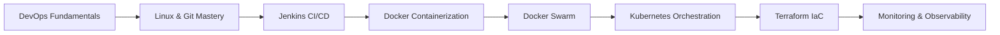

# Section 2: DevOps & Infrastructure as Code 🚀 changed info to check and test cloning, adding, commit, push add etc.

> Comprehensive DevOps training program designed to advance your career as a Cloud & DevOps Engineer

## 📋 Table of Contents
- [Section Overview](#-section-overview)
- [Learning Path](#️-learning-path)
- [Session Structure](#-session-structure)
- [Technologies Covered](#-technologies-covered)
- [Hands-On Projects](#-hands-on-projects)
- [Prerequisites](#-prerequisites)
- [Learning Outcomes](#-learning-outcomes)
- [Assessment Methods](#-assessment-methods)
- [Career Impact](#-career-impact)
- [Getting Started](#-getting-started)

## 🎯 Section Overview

This section focuses on **DevOps practices, Infrastructure as Code (IaC), and automation tools** that bridge the gap between development and operations. You'll master the complete DevOps toolchain through hands-on projects and real-world implementations.

### Key Focus Areas:
- **Continuous Integration & Continuous Delivery/Deployment (CI/CD)**
- **End-to-end Product Automation**
- **Configuration Management**
- **Infrastructure-as-a-Service (IaaS)**
- **Container Orchestration & Management**
- **Cloud-native Application Development**

### Program Features:
- ✅ **Full hands-on approach** with real-world scenarios
- ✅ **Progressive skill building** from basics to advanced
- ✅ **Multi-cloud deployment** experience (AWS, GCP, Azure)
- ✅ **Industry best practices** and modern toolchain
- ✅ **Project-based learning** with portfolio development

## 🛤️ Learning Path

<div align="center">


</div>



### Progression Timeline:
- **Weeks 1-2:** DevOps Culture & Linux Fundamentals
- **Weeks 3-4:** Version Control & CI/CD with Jenkins
- **Weeks 5-6:** Containerization with Docker & Docker Swarm
- **Weeks 7-9:** Container Orchestration with Kubernetes
- **Weeks 10-11:** Infrastructure as Code with Terraform
- **Week 12:** Monitoring & Observability

## 📚 Session Structure

<details>
<summary><strong>📖 Session 1: Introduction to DevOps</strong></summary>

**Duration:** 2 weeks | **Focus:** DevOps culture, principles, and transformation

### Topics Covered:
- DevOps vs Traditional IT approaches
- Cultural transformation and team collaboration
- DevOps roles and responsibilities (DevOps Engineer, SRE, Platform Engineer)
- Business value and ROI of DevOps adoption
- DevOps patterns and frameworks (CALMS, Three Ways, DORA metrics)
- Legacy system problems and DevOps solutions

### Learning Outcomes:
- ✅ Understand DevOps principles and core concepts
- ✅ Identify the gap between traditional Dev and Ops teams
- ✅ Recognize DevOps roles and career opportunities
- ✅ Apply DevOps frameworks to real-world scenarios

### Key Resources:
- [Session 1 Materials](./Session-1_Introduction-to-DevOps/)
- DevOps Culture Assessment
- Industry Case Studies
- Framework Implementation Guides

</details>

<details>
<summary><strong>🐧 Session 2: Linux Fundamentals</strong></summary>

**Duration:** 2 weeks | **Focus:** Essential Linux skills for DevOps professionals

### Topics Covered:
- Command line proficiency and shell scripting
- File system navigation and permissions management
- Process management and system monitoring
- Package management and software installation
- Network configuration and troubleshooting
- System administration and security basics

### Learning Outcomes:
- ✅ Master essential Linux commands and operations
- ✅ Write effective shell scripts for automation
- ✅ Manage system processes and resources
- ✅ Configure networking and security settings

### Practical Labs:
- Linux Command Line Mastery
- Shell Scripting for Automation
- System Administration Tasks
- Network Configuration Labs

### Key Resources:
- [Session 2 Materials](./Session-2_Linux-Fundamentals/)
- Linux Command Reference
- Shell Scripting Examples
- System Administration Guides

</details>

<details>
<summary><strong>🔀 Session 3: Mastering Git</strong></summary>

**Duration:** 2 weeks | **Focus:** Version control and collaborative development

### Topics Covered:
- Git fundamentals and repository management
- Branching strategies and merge workflows
- Collaborative development with GitHub/GitLab
- Git hooks and automation integration
- Best practices for code versioning
- Advanced Git operations and troubleshooting

### Learning Outcomes:
- ✅ Implement effective Git workflows
- ✅ Manage complex branching strategies
- ✅ Collaborate effectively using Git platforms
- ✅ Integrate Git with CI/CD pipelines

### Practical Labs:
- Git Workflow Implementation
- Branch Management Strategies
- Collaborative Development Scenarios
- Git Hooks and Automation

### Key Resources:
- [Session 3 Materials](./Session-3_Mastering-Git/)
- Git Best Practices Guide
- Branching Strategy Templates
- Collaboration Workflows

</details>

<details>
<summary><strong>⚙️ Session 4: Jenkins - CI/CD Fundamentals</strong></summary>

**Duration:** 2 weeks | **Focus:** Continuous Integration & Continuous Delivery/Deployment automation

### Topics Covered:

#### 1. Jenkins Installation & Setup
- Jenkins architecture and components
- Installation on various platforms (Linux, Windows, macOS)
- Initial configuration and security setup
- Plugin management and ecosystem

#### 2. Master-Slave Configuration & Multi-mode
- Distributed builds and scaling strategies
- Node management and configuration
- Load balancing and resource optimization
- Security considerations for distributed setups

#### 3. Job & Pipeline Creation
- Freestyle jobs and parameterized builds
- Pipeline as Code (PaC) implementation
- Declarative vs Scripted pipelines
- Pipeline syntax and best practices

#### 4. Build, Integration & Delivery Pipelines
- Multi-stage pipeline design
- Integration with testing frameworks
- Deployment automation and rollback strategies
- Environment promotion workflows

#### 5. Advanced Jenkins Features
- Plugin ecosystem and management
- Security and access control (RBAC)
- Monitoring and maintenance
- Integration with external tools

### Learning Outcomes:
- ✅ Design and implement automated CI/CD pipelines
- ✅ Configure distributed Jenkins environments
- ✅ Create Pipeline as Code solutions
- ✅ Integrate testing and deployment automation

### Practical Labs:
- Jenkins Installation and Configuration
- Pipeline Creation and Management
- Multi-stage Deployment Pipelines
- Integration with AWS, GCP, and Azure

### Key Resources:
- [Session 4 Materials](./Session-4_Jenkins/)
- Jenkins Pipeline Examples
- Plugin Configuration Guides
- Security Best Practices

</details>

<details>
<summary><strong>🐳 Session 5: Docker - Containerization Fundamentals</strong></summary>

**Duration:** 2 weeks | **Focus:** Container technology and application packaging

### Topics Covered:

#### 1. Container Technology Fundamentals
- Understanding containers vs virtual machines
- Docker architecture and components
- Container lifecycle and management
- Image creation and optimization

#### 2. Docker Operations & Management
- Docker installation and configuration
- Container creation, execution, and monitoring
- Image building with Dockerfiles
- Container networking and storage

#### 3. Multi-Container Applications
- Docker Compose for multi-service applications
- Service orchestration and dependencies
- Environment management and configuration
- Container communication patterns

#### 4. Production Considerations
- Security best practices for containers
- Performance optimization and monitoring
- Container registry management
- Deployment strategies and patterns

### Learning Outcomes:
- ✅ Build and manage Docker containers
- ✅ Create optimized container images
- ✅ Orchestrate multi-container applications
- ✅ Implement container security practices

### Practical Labs:
- Docker Installation and Configuration
- Container Creation and Management
- Multi-service Application Deployment
- Container Security Implementation

### Key Resources:
- [Session 5 Materials](./Session-5_Docker/)
- Docker Best Practices Guide
- Container Security Checklist
- Multi-container Application Examples

</details>

<details>
<summary><strong>🐙 Session 6: Docker Swarm - Container Orchestration</strong></summary>

**Duration:** 1 week | **Focus:** Docker native orchestration platform

### Topics Covered:

#### 1. Docker Swarm Fundamentals
- Swarm mode architecture and concepts
- Cluster initialization and node management
- Service creation and scaling
- Load balancing and service discovery

#### 2. Production Deployment Patterns
- Multi-node cluster setup
- Rolling updates and rollback strategies
- Health checks and service monitoring
- Secrets and configuration management

### Learning Outcomes:
- ✅ Deploy and manage Docker Swarm clusters
- ✅ Orchestrate containerized applications at scale
- ✅ Implement high availability patterns
- ✅ Manage cluster security and secrets

### Practical Labs:
- Swarm Cluster Setup and Management
- Service Deployment and Scaling
- Rolling Updates and Health Monitoring
- Multi-environment Configuration

### Key Resources:
- [Session 6 Materials](./Session-6_Docker-Swarm/)
- Swarm Deployment Examples
- Cluster Management Scripts
- Production Configuration Templates

</details>

<details>
<summary><strong>☸️ Session 7: Kubernetes - Container Orchestration at Scale</strong></summary>

**Duration:** 3 weeks | **Focus:** Production-grade container orchestration

### Topics Covered:

#### 1. Kubernetes Fundamentals & Setup
- Kubernetes architecture and components
- Cluster setup with K3s (lightweight Kubernetes)
- kubectl command-line interface
- Basic troubleshooting and cluster validation

#### 2. Core Kubernetes Concepts
- Pods, Services, and Deployments explained
- Container orchestration principles
- Kubernetes resource management
- Real-world analogies and practical understanding

#### 3. Application Deployment & Management
- Pod creation and lifecycle management
- Multi-container applications
- Labels, selectors, and organization
- Debugging and log analysis

#### 4. Scaling & Production Deployments
- Deployment strategies and scaling
- Rolling updates and rollback procedures
- Health checks and self-healing applications
- Resource limits and performance optimization

#### 5. Service Discovery & Networking
- Service types and networking patterns
- Load balancing and traffic distribution
- Inter-service communication
- External access and ingress patterns

#### 6. Complete Application Project
- Full-stack Todo application deployment
- Multi-tier architecture (Frontend, API, Database)
- Production-ready configurations
- Real-world troubleshooting scenarios

### Learning Outcomes:
- ✅ Deploy and manage Kubernetes clusters
- ✅ Orchestrate complex multi-service applications
- ✅ Implement scaling and update strategies
- ✅ Configure service networking and discovery
- ✅ Build production-ready containerized applications
- ✅ Troubleshoot and monitor Kubernetes workloads

### Practical Labs:
- K3s Cluster Setup and Configuration
- Pod and Deployment Management
- Service Discovery and Networking
- Complete Todo Application Project
- Production Deployment Patterns

### Key Resources:
- [Session 7 Materials](./Session-7_Kubernetes/)
- Kubernetes Configuration Examples
- Troubleshooting Guides and Best Practices
- Production Deployment Templates

</details>

<details>
<summary><strong>🏗️ Session 8: Terraform & Infrastructure Automation</strong></summary>

**Duration:** 2 weeks | **Focus:** Infrastructure as Code and automation

### Topics Covered:

#### 1. Infrastructure as Code Principles
- IaC concepts and benefits
- Declarative vs Imperative approaches
- Version control for infrastructure
- Infrastructure testing and validation

#### 2. Terraform Installation & Workflows
- Terraform architecture and components
- Installation and configuration across platforms
- Terraform workflow (init, plan, apply, destroy)
- State management and remote backends

#### 3. Configuration Management & Orchestration
- HCL (HashiCorp Configuration Language) syntax
- Resource provisioning and dependencies
- Data sources and local values
- Functions and expressions

#### 4. Resource Provisioning & Deployments
- Multi-cloud resource management (AWS, GCP, Azure)
- Modules and reusable components
- Environment management and promotion
- Security and compliance considerations

### Learning Outcomes:
- ✅ Automate cloud infrastructure provisioning
- ✅ Implement Infrastructure as Code best practices
- ✅ Manage infrastructure across multiple environments
- ✅ Create reusable Terraform modules

### Practical Labs:
- Terraform Fundamentals
- Multi-cloud Resource Provisioning
- Module Development and Management
- State Management and Collaboration

### Key Resources:
- [Session 8 Materials](./Session-8_terraform_and_infra_automation/)
- Terraform Configuration Examples
- Module Library and Templates
- Multi-cloud Deployment Guides

</details>

<details>
<summary><strong>🔴 Session 9: OpenShift - Enterprise Kubernetes Platform</strong></summary>

**Duration:** 2 weeks | **Focus:** Enterprise container platform and advanced Kubernetes

### Topics Covered:

#### 1. OpenShift Fundamentals
- OpenShift vs Kubernetes comparison
- OpenShift architecture and components
- Developer and administrator perspectives
- Enterprise features and capabilities

#### 2. Getting Started with OpenShift
- OpenShift Sandbox setup and access
- CLI (oc) installation and configuration
- Web console navigation and usage
- Basic project and application management

#### 3. Application Deployment Patterns
- Source-to-Image (S2I) builds
- Container image deployments
- Multi-service applications
- Database integration and persistence

#### 4. Advanced OpenShift Features
- Auto-scaling and resource management
- Blue-Green deployment strategies
- CI/CD integration with OpenShift Pipelines
- Service mesh and microservices architecture

#### 5. Hands-On Projects
- **Project 0:** Getting Started - CLI login and basic deployment
- **Projects 1-3:** Basic applications (Nginx, Node.js, Python+Database)
- **Projects 4-6:** Advanced patterns (Multi-service, Auto-scaling, Blue-Green)

### Learning Outcomes:
- ✅ Deploy applications on OpenShift platform
- ✅ Understand enterprise Kubernetes features
- ✅ Implement advanced deployment strategies
- ✅ Configure auto-scaling and resource management
- ✅ Build CI/CD pipelines with OpenShift tools

### Practical Labs:
- OpenShift Sandbox setup and configuration
- Source-to-Image application builds
- Multi-tier application deployment
- Auto-scaling and blue-green deployments
- OpenShift Pipelines and GitOps workflows

### Key Resources:
- [Session 9 Materials](./Session-9_OpenShift/)
- OpenShift project templates and examples
- Deployment strategy guides
- Enterprise best practices documentation

</details>

<details>
<summary><strong>📊 Session 10: Monitoring Tools & Observability</strong></summary>

**Duration:** 1 week | **Focus:** Application and infrastructure monitoring

### Topics Covered:

#### 1. Monitoring Fundamentals
- Observability principles (Metrics, Logs, Traces)
- Monitoring strategy and best practices
- SLA, SLI, and SLO concepts
- Alert management and incident response

#### 2. Nagios Monitoring
- Nagios Core installation and configuration
- Host and service monitoring setup
- Custom plugin development
- Alert notifications and escalations

#### 3. ELK Stack Integration
- Elasticsearch, Logstash, and Kibana setup
- Log aggregation and analysis
- Dashboard creation and visualization
- Integration with Nagios for comprehensive monitoring

#### 4. Production Monitoring Patterns
- Infrastructure monitoring best practices
- Application performance monitoring (APM)
- Distributed tracing and debugging
- Capacity planning and trend analysis

### Learning Outcomes:
- ✅ Implement comprehensive monitoring solutions
- ✅ Configure alerting and notification systems
- ✅ Create monitoring dashboards and visualizations
- ✅ Integrate monitoring with CI/CD pipelines
- ✅ Apply observability best practices

### Practical Labs:
- Nagios installation and configuration
- ELK stack deployment and setup
- Custom monitoring dashboard creation
- Alert configuration and testing
- Integration with existing infrastructure

### Key Resources:
- [Session 10 Materials](./Session-10_Monitoring-Tools/)
- Nagios configuration examples
- ELK stack deployment guides
- Monitoring best practices documentation

</details>

## 💻 Technologies Covered

### Core DevOps Tools


### Containerization & Orchestration


### Cloud Platforms


### Monitoring & Observability


## 🚀 Hands-On Projects

<details>
<summary><strong>📖 Session 1: DevOps Culture & Philosophy</strong></summary>

### Project Focus:
DevOps transformation assessment and culture implementation

### Project Scope:
- Analyze traditional vs DevOps approaches
- Create DevOps transformation roadmap
- Implement team collaboration frameworks
- Assess organizational readiness for DevOps

### Skills Developed:
- DevOps culture and principles
- Change management strategies
- Team collaboration techniques
- Business value assessment

### Timeline: 1 week

</details>

<details>
<summary><strong>🐧 Session 2: Linux System Administration</strong></summary>

### Project Focus:
Complete Linux system administration and automation

### Project Scope:
- **Project 1:** Linux fundamentals and system administration
- Set up automated server provisioning
- Implement system monitoring and maintenance
- Create shell scripts for common tasks
- Configure security and user management

### Skills Developed:
- Linux command line mastery
- Shell scripting and automation
- System administration
- Security configuration

### Timeline: 1 week

</details>

<details>
<summary><strong>🔀 Session 3: Git Version Control Mastery</strong></summary>

### Project Focus:
Advanced Git workflows and collaboration

### Project Scope:
- **Project 1:** Git Fundamentals - Complete workflow implementation
- **Project 2:** GitLab CI/CD - Automated pipeline setup
- Implement branching strategies
- Set up collaborative development workflows
- Configure Git hooks and automation

### Skills Developed:
- Advanced Git operations
- Branching and merging strategies
- Collaborative development
- CI/CD integration with Git

### Timeline: 1.5 weeks

</details>

<details>
<summary><strong>⚙️ Session 4: Jenkins CI/CD Automation</strong></summary>

### Project Focus:
Enterprise CI/CD pipeline implementation

### Project Scope:
- **Infrastructure Setup:** EC2 with Terraform
- **Basic Jobs:** Freestyle and Maven projects
- **Pipeline Fundamentals:** Hello World pipeline
- **Master-Slave Architecture:** Distributed builds
- **Final Project:** Complete CI/CD with Git integration
- Multi-stage deployment pipelines
- Automated testing and quality gates

### Skills Developed:
- Jenkins installation and configuration
- Pipeline as Code implementation
- Distributed build systems
- CI/CD best practices

### Timeline: 2 weeks

</details>

<details>
<summary><strong>🐳 Session 5: Docker Containerization</strong></summary>

### Project Focus:
Container-based application deployment

### Project Scope:
- **Docker Basics:** Container fundamentals
- **Docker Project:** Multi-service application containerization
- **Docker Registry:** Private registry setup
- Container optimization and security
- Multi-container application orchestration

### Skills Developed:
- Docker container management
- Dockerfile optimization
- Container networking and storage
- Registry management

### Timeline: 1.5 weeks

</details>

<details>
<summary><strong>🐙 Session 6: Docker Swarm Orchestration</strong></summary>

### Project Focus:
Container orchestration with Docker Swarm

### Project Scope:
- **Swarm Basics:** Cluster setup and management
- **Stack Project:** Multi-service stack deployment
- Service scaling and load balancing
- Rolling updates and health monitoring
- Production deployment patterns

### Skills Developed:
- Docker Swarm cluster management
- Service orchestration
- Load balancing and scaling
- Production deployment strategies

### Timeline: 1 week

</details>

<details>
<summary><strong>☸️ Session 7: Kubernetes Container Orchestration</strong></summary>

### Project Focus:
Production-grade Kubernetes deployment

### Project Scope:
- **Setup:** K3s cluster installation and configuration
- **Concepts:** Core Kubernetes resources and architecture
- **Pods:** Container lifecycle and management
- **Deployments & Scaling:** Application deployment strategies
- **Services & Networking:** Service discovery and load balancing
- **Final Project:** Complete Todo application (3-tier architecture)

### Skills Developed:
- Kubernetes cluster management
- Application deployment and scaling
- Service networking and discovery
- Production troubleshooting

### Timeline: 3 weeks

</details>

<details>
<summary><strong>🏗️ Session 8: Terraform Infrastructure as Code</strong></summary>

### Project Focus:
Multi-cloud infrastructure automation

### Project Scope:
- **Introduction & History:** IaC fundamentals
- **Architecture Overview:** Terraform components and workflow
- **Basic Commands:** Core Terraform operations
- **Local File Example:** Basic resource management
- **S3 Bucket Example:** AWS resource provisioning
- **EC2 Instance Example:** Compute resource automation
- **Configuration Management:** Advanced Terraform features
- **Final Projects:** Complete infrastructure deployments (2 projects)

### Skills Developed:
- Infrastructure as Code principles
- Multi-cloud resource management
- Terraform module development
- State management and collaboration

### Timeline: 2 weeks

</details>

<details>
<summary><strong>🔴 Session 9: OpenShift Enterprise Platform</strong></summary>

### Project Focus:
OpenShift fundamentals and enterprise Kubernetes features

### Project Scope:
- **Theory:** Kubernetes to OpenShift transition guide
- **Project 0:** Getting Started - CLI login and basic deployment
- OpenShift CLI (oc) usage and workflows
- Routes and networking configuration
- Source-to-Image (S2I) build concepts
- Enterprise security and RBAC features

### Skills Developed:
- OpenShift platform management
- Enterprise Kubernetes features
- CLI-based deployment workflows
- Route creation and HTTPS configuration

### Timeline: 2 weeks

</details>

<details>
<summary><strong>📊 Session 10: Monitoring & Observability</strong></summary>

### Project Focus:
Comprehensive monitoring and alerting

### Project Scope:
- **Nagios Setup:** Infrastructure monitoring implementation
- **ELK Integration:** Log aggregation and analysis
- Custom monitoring dashboards
- Alert configuration and incident response
- Performance monitoring and optimization

### Skills Developed:
- Infrastructure monitoring setup
- Log aggregation and analysis
- Dashboard creation and visualization
- Alert management and incident response

### Timeline: 1 week

</details>

## 🔧 Prerequisites

<details>
<summary><strong>📋 Technical Requirements</strong></summary>

### Knowledge Prerequisites:
- **Basic Linux/Unix knowledge** - Command line familiarity
- **Programming fundamentals** - Any programming language (Java, Python, JavaScript)
- **Networking basics** - TCP/IP, DNS, HTTP/HTTPS concepts
- **Cloud awareness** - Basic understanding of cloud services and concepts

### Software Requirements:
- **Computer specifications:** Minimum 8GB RAM, 50GB free disk space
- **Operating System:** Linux, macOS, or Windows with WSL2
- **Internet connection:** Stable broadband for cloud platform access
- **Accounts:** AWS, GCP, and Azure accounts (free tier eligible)

</details>

<details>
<summary><strong>🛠️ Development Environment Setup</strong></summary>

### Essential Tools Installation:

```bash
# Update system packages
sudo apt-get update && sudo apt-get upgrade -y

# Git installation
sudo apt-get install git -y

# Docker installation
curl -fsSL https://get.docker.com -o get-docker.sh
sh get-docker.sh
sudo usermod -aG docker $USER

# AWS CLI installation
curl "https://awscli.amazonaws.com/awscli-exe-linux-x86_64.zip" -o "awscliv2.zip"
unzip awscliv2.zip && sudo ./aws/install

# Google Cloud CLI installation
curl https://sdk.cloud.google.com | bash
exec -l $SHELL
gcloud init

# Azure CLI installation
curl -sL https://aka.ms/InstallAzureCLIDeb | sudo bash

# Terraform installation
wget https://releases.hashicorp.com/terraform/1.5.0/terraform_1.5.0_linux_amd64.zip
unzip terraform_1.5.0_linux_amd64.zip && sudo mv terraform /usr/local/bin/

# kubectl installation
curl -LO "https://dl.k8s.io/release/$(curl -L -s https://dl.k8s.io/release/stable.txt)/bin/linux/amd64/kubectl"
chmod +x kubectl && sudo mv kubectl /usr/local/bin/

# Jenkins CLI (optional)
wget http://localhost:8080/jnlpJars/jenkins-cli.jar

# Verify installations
echo "Verifying installations..."
git --version
docker --version
aws --version
gcloud --version
az --version
terraform --version
kubectl version --client
```

### IDE and Extensions:
- **Visual Studio Code** with extensions:
  - HashiCorp Terraform
  - Jenkins Pipeline Linter
  - Docker
  - Kubernetes
  - AWS Toolkit
  - Google Cloud Code

</details>

## 🎓 Learning Outcomes

<details>
<summary><strong>🔧 Technical Mastery</strong></summary>

Upon completion of Section 2, you will be able to:

### Core DevOps Skills:
- ✅ **Design and implement** end-to-end CI/CD pipelines using Jenkins
- ✅ **Automate infrastructure** provisioning with Terraform across AWS, GCP, and Azure
- ✅ **Manage containerized applications** with Docker and Kubernetes
- ✅ **Configure and maintain** Jenkins automation servers and distributed builds
- ✅ **Implement DevOps best practices** in enterprise environments
- ✅ **Troubleshoot and optimize** DevOps workflows and pipelines
- ✅ **Deploy applications** on multiple cloud platforms with consistency

### Advanced Capabilities:
- ✅ **Multi-cloud strategy** implementation and management
- ✅ **Infrastructure as Code** best practices and module development
- ✅ **Security integration** throughout the DevOps lifecycle
- ✅ **Monitoring and observability** setup and maintenance
- ✅ **Cost optimization** across cloud platforms and resources

</details>

<details>
<summary><strong>👥 Professional Skills</strong></summary>

### Collaboration and Leadership:
- ✅ **Collaborate effectively** in cross-functional DevOps teams
- ✅ **Apply DevOps culture** and principles in organizations
- ✅ **Communicate technical concepts** to stakeholders and management
- ✅ **Lead DevOps transformation** initiatives and change management
- ✅ **Mentor junior team members** in DevOps practices and tools

### Business Acumen:
- ✅ **Optimize costs** and performance in multi-cloud environments
- ✅ **Align technical solutions** with business objectives
- ✅ **Measure and report** on DevOps metrics and KPIs
- ✅ **Risk assessment** and mitigation in deployment strategies

</details>

<details>
<summary><strong>🚀 Career Readiness</strong></summary>

### Primary Career Paths:
- ✅ **DevOps Engineer** - Pipeline automation and infrastructure management
- ✅ **Site Reliability Engineer (SRE)** - System reliability and performance optimization
- ✅ **Platform Engineer** - Internal developer platform creation and management
- ✅ **Cloud Engineer** - Multi-cloud infrastructure and services
- ✅ **Automation Engineer** - Process automation and optimization

### Specialized Roles:
- ✅ **DevSecOps Engineer** - Security integration in DevOps workflows
- ✅ **Infrastructure Engineer** - Large-scale infrastructure management
- ✅ **Release Manager** - Release coordination and deployment strategies
- ✅ **Cloud Architect** - Multi-cloud architecture design and implementation

</details>

## 📊 Assessment Methods

<details>
<summary><strong>🛠️ Practical Assessments (70%)</strong></summary>

### Hands-on Evaluations:
- **Project Implementations** - Real-world scenario solutions
- **Code Reviews** - Infrastructure and pipeline configurations
- **Lab Exercises** - Guided practice with immediate feedback
- **Troubleshooting Scenarios** - Problem-solving under time pressure
- **Peer Reviews** - Collaborative assessment and learning

### Assessment Criteria:
- **Functionality** - Does the solution work as intended?
- **Best Practices** - Follows industry standards and conventions
- **Security** - Implements appropriate security measures
- **Documentation** - Clear and comprehensive documentation
- **Efficiency** - Optimized for performance and cost

</details>

<details>
<summary><strong>📚 Knowledge Assessments (30%)</strong></summary>

### Theoretical Evaluations:
- **Technical Quizzes** - Tool-specific knowledge validation
- **Case Studies** - Real-world problem analysis and solution design
- **Best Practices Reviews** - Industry standard implementations
- **Concept Explanations** - Understanding of DevOps principles
- **Architecture Reviews** - System design and decision rationale

### Success Metrics:
- **Project Completion Rate:** 100% of assigned projects
- **Code Quality Score:** Minimum 85% on code reviews
- **Technical Proficiency:** Pass all tool-specific assessments
- **Collaboration Score:** Effective teamwork in group projects
- **Innovation Factor:** Creative problem-solving approaches

</details>

## 💼 Career Impact

<details>
<summary><strong>📈 Industry Statistics (2025)</strong></summary>

### Market Trends:
- **DevOps Adoption:** 91% of enterprises have implemented DevOps practices
- **Job Growth:** 156% projected growth for DevOps roles (2025-2030)
- **Salary Range:** $95,000 - $165,000 for DevOps engineers (varies by location)
- **ROI Impact:** 285% average return on DevOps investment within 18 months

### Skills Demand Analysis:
- **Container Orchestration:** Kubernetes expertise (82% usage in production)
- **Infrastructure as Code:** Terraform and CloudFormation (71% adoption rate)
- **CI/CD Automation:** Jenkins, GitHub Actions, GitLab CI (49% market share)
- **Multi-Cloud Platforms:** AWS, GCP, Azure certifications in high demand
- **Security Integration:** DevSecOps practices (73% vulnerability reduction)

</details>

<details>
<summary><strong>🏆 Certification Preparation</strong></summary>

This program prepares you for industry-leading certifications:

### Cloud Platform Certifications:
- **AWS Certified DevOps Engineer** - Professional level
- **Google Cloud Professional DevOps Engineer** - Professional level
- **Microsoft Azure DevOps Engineer Expert** - Expert level

### Tool-Specific Certifications:
- **Certified Kubernetes Administrator (CKA)** - CNCF certification
- **HashiCorp Certified: Terraform Associate** - Infrastructure automation
- **Jenkins Engineer Certification** - CI/CD expertise
- **Docker Certified Associate (DCA)** - Container expertise

### Preparation Support:
- Practice exams and study guides
- Hands-on lab environments
- Certification-focused projects
- Expert guidance and mentorship

</details>

## 🚀 Getting Started

<details>
<summary><strong>🔧 Step 1: Environment Setup</strong></summary>

### Repository Setup:
```bash
# Clone the repository
git clone https://github.com/manikcloud/cloud-devops-learning-path.git
cd cloud-devops-learning-path/Section-2-DevOps

# Explore the structure
ls -la
```

### Development Environment:
Follow the [Development Environment Setup](#-development-environment-setup) section above for complete tool installation.

### Cloud Account Configuration:
```bash
# AWS Configuration
aws configure
# Enter your AWS Access Key ID, Secret Access Key, Region, and Output format

# GCP Configuration
gcloud auth login
gcloud config set project YOUR_PROJECT_ID

# Azure Configuration
az login
az account set --subscription YOUR_SUBSCRIPTION_ID
```

</details>

<details>
<summary><strong>📚 Step 2: Begin Learning Journey</strong></summary>

### Learning Sequence:
1. **Start with Session 1:** [Introduction to DevOps](./Session-1_Introduction-to-DevOps/)
2. **Progress systematically:** Complete each session in the prescribed order
3. **Practice regularly:** Use hands-on labs and exercises daily
4. **Build projects:** Apply learning through practical implementations
5. **Seek feedback:** Participate in code reviews and peer assessments

### Study Schedule Recommendation:
- **Daily commitment:** 2-3 hours of focused learning
- **Weekly goals:** Complete one major topic or lab
- **Project time:** Dedicate weekends to project work
- **Review sessions:** Weekly review of completed materials

</details>

<details>
<summary><strong>🤝 Step 3: Community Engagement</strong></summary>

### Learning Community:
- **Join discussion forums** for peer learning and Q&A
- **Participate in code reviews** and collaborative projects
- **Attend virtual meetups** and industry webinars
- **Contribute to open source** DevOps projects and tools

### Professional Networking:
- **LinkedIn DevOps groups** and professional connections
- **Local DevOps meetups** and conferences
- **Industry certifications** and badge sharing
- **Mentorship opportunities** both as mentee and mentor

</details>

## 📖 Resources & Support

<details>
<summary><strong>📚 Documentation Links</strong></summary>

### Official Documentation:
- [Jenkins Documentation](https://www.jenkins.io/doc/) - Comprehensive Jenkins guides and tutorials
- [Terraform Documentation](https://www.terraform.io/docs/) - Infrastructure as Code reference
- [Docker Documentation](https://docs.docker.com/) - Container platform guides
- [Kubernetes Documentation](https://kubernetes.io/docs/) - Container orchestration reference

### Cloud Platform Documentation:
- [AWS Documentation](https://docs.aws.amazon.com/) - Amazon Web Services reference
- [GCP Documentation](https://cloud.google.com/docs) - Google Cloud Platform guides
- [Azure Documentation](https://docs.microsoft.com/azure/) - Microsoft Azure reference

### Additional Resources:
- [Git Documentation](https://git-scm.com/doc) - Version control system reference
- [Linux Documentation](https://www.kernel.org/doc/) - Linux kernel and system guides
- [DevOps Institute](https://devopsinstitute.com/) - Industry best practices and research

</details>

<details>
<summary><strong>🎓 Community Support</strong></summary>

### Learning Support:
- **Course discussion forums** - Peer learning and technical Q&A
- **Weekly office hours** - Direct instructor support and guidance
- **Study groups** - Collaborative learning sessions and project work
- **Industry mentorship** - Professional guidance and career networking

### Technical Support:
- **Lab environment access** - Cloud-based practice environments
- **Tool installation guides** - Step-by-step setup instructions
- **Troubleshooting resources** - Common issues and solutions
- **Video tutorials** - Supplementary visual learning content

</details>

<details>
<summary><strong>📖 Additional Learning Resources</strong></summary>

### Supplementary Materials:
- **Video tutorials** - Visual learning supplements for complex topics
- **Practice labs** - Additional hands-on skill reinforcement
- **Industry blogs** - Latest trends, tools, and best practices
- **Certification guides** - Exam preparation materials and practice tests

### Recommended Reading:
- "The Phoenix Project" by Gene Kim
- "The DevOps Handbook" by Gene Kim, Jez Humble, Patrick Debois
- "Accelerate" by Nicole Forsgren, Jez Humble, Gene Kim
- "Site Reliability Engineering" by Google

</details>

---

## 🎯 Ready to Transform Your Career?

**DevOps is not just about tools—it's about culture, collaboration, and continuous improvement.** This comprehensive program will equip you with both the technical skills and professional mindset needed to excel in modern DevOps environments.

Start your journey today and join the ranks of high-performing DevOps professionals who are driving digital transformation across industries.

**Next Step:** Begin with [Session 1: Introduction to DevOps](./Session-1_Introduction-to-DevOps/) to understand the fundamental principles that will guide your entire learning journey.

---

**Created by Varun Kumar Manik**  
*AWS Ambassador | Kubernetes Expert | DevOps Specialist*

**Program Inspiration:** Pragra DevOps Mastering Tools Program  
*"Onward & Upward"* 🚀

*Last Updated: July 2025*
